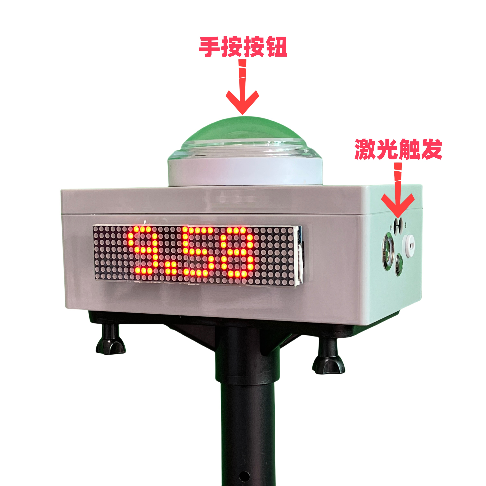
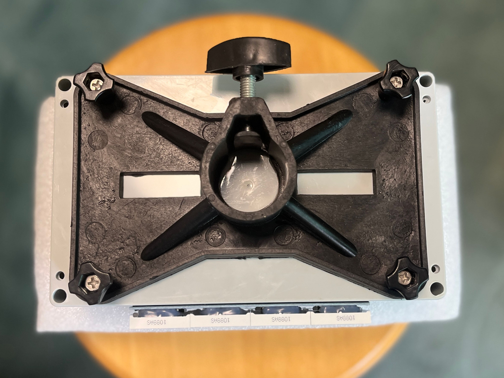
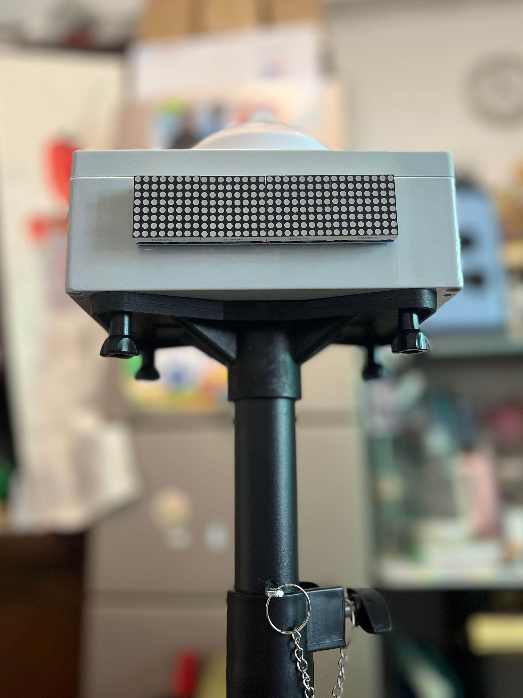

# 指南

## 介绍

IORI 计时器是一个简单易用的计时器，可以快速协助教练完成队员的测试评估，也可以作为个人训练的强大辅助工具。

### 为什么做

我们团队组织了一个非营利的成人足球训练营，会保持一周一练，同时我们也会给一些青训俱乐部做教练。在长期的训练中发现一直存在如何评估队员的问题。以下引用欧足联教练手册对于评估的定义。

> Evaluation tests, which involve practical exercises designed specifically to obtain the most precise and objective data possible from the basic game components forming part of the teaching content. This type of evaluation is also known as the quantitative method.  
> 评估测试，指为从构成教学内容的基本游戏内容中获得最精确、最客观的数据而专门设计的实践练习。这种类型的评估也被称为定量方法。  
> —— UEFA Fusal Coaching Manual

常见的评估测试包括 30 米冲刺、T 字测试、5-10-5 敏捷测试等。我们也可以根据自身的项目特点创建适合的评估测试项目。因为评估是训练中必不可少的一环，那我们有没有趁手的工具呢？

### 为什么不是...?

#### 秒表/手机

秒表包括手机、运动手表等都有计时功能。首先启动和结束会造成人为误差，在短距离冲刺上会更加明显；其次是结果展示和记录不方便。

#### 普通红外计时器

普通红外计时器大都需要反射板，设置复杂。第二个是缺少手按的启动方式，无法反映准确的纯速度能力。例如 NFL 的 40 码冲刺测试是不计算反应时间的。

### IORI 计时器的特点

- **无反射板设计**  
  开机即用，任意调整计时位置
- **无惧阳光干扰**  
  即使中午大太阳，同样保持稳定和精确
- **分段计时和多道计时**  
  多种模式任意转换
- **可连续工作 10 小时**  
  内置锂电池，长续航，保证训练不间断

## 快速开始

1. 长按 **准备/READY**
2. 松手 **开始**
3. 激光触发 **停止**
4. 长按再次 **准备/READY**

<!--  -->

<video class="responsive-video" src="../public/videos/10m&30m Sprint.mp4" poster="../public/videos/10m&30m Sprint.png" controls ></video>

<!--  -->

## 如何工作

### 无需反射板的激光触发

IORI 计时器采用对人体安全的红外激光触发，无需反射板。默认情况下，其触发距离为 1.3 米，约为一个标准跑道的宽度。针对不同运动项目的需求，触发距离可调整为 2.3 米、4.3 米或 6.3 米，从而适合各种要求的测试。

### 长距离无线连接

IORI 计时器采用远距离无线协议，连接距离大于 200 米，控制稳定可靠。它可以支持 100m、200m、400m 距离的单人或多人测试。同时它支持 11 个设备同时连接，非常适合创建 100m 分段计时系统，记录全程 10 米分段成绩。

## 如何使用

IORI 计时器支持几乎所有的冲刺和敏捷性测试。我们来了解一下。

### 田径

通常地，需要一个朋友帮你发令，按住 **READY** 预备，释放的同时喊发令 **跑**。这样测试将包含反应时间，终点使用激光触发结束。

<!--  -->

<video class="responsive-video" src="../public/videos/100m.mp4" poster="../public/videos/100m.png" controls ></video>

<!--  -->

#### 区间或行进间计时

以前，当使用秒表时，区间或行进间测试非常难获得准确的数据。如今，你只需放置计时器在你需要的位置，就可以获得任何区间的时间。
我们支持激光触发启动，同时终点也是激光触发结束。

<!--  -->

<video class="responsive-wide-video" src="../public/videos/Flying Test.mp4" poster="../public/videos/Flying Test.png" controls ></video>

<!--  -->

### 橄榄球 40 码冲刺

按照 NFL Combine 的要求，40 码测试在运动员启动后才开始计时。因此运动员自己手按计时器准备，3 点式启动更合适。这将不包含启动反应时间，非常接近 NFL 的正式测试。终点仍然是激光触发结束。

<!--  -->

<video class="responsive-video" src="../public/videos/40 Yard Dash.mp4" poster="../public/videos/40 Yard Dash.png" controls ></video>

<!--  -->

## 模式设置

按住顶部大按钮再开机，进入设置模式。短按切换选项，长按确认。

模式：M.开头

- TAP：起点终点计时，显示完整成绩。适合单人 100m 或者区间计时。
- SPT：分段计时，放置在起点和终点之间，显示分段成绩。
- MORE：更多模式选择，长按进入子菜单选择
  - PK：多道计时，用于起点多道计时发令。此时终点每道使用 SPT 模式。
  - SET：起跑倒计时发令，SET 和 GO 之间随机 1.5-3.5 秒发枪。可代替起点的 TAP 或 PK 模式。
  - ADD：多人计时，每次触发增加一次计时。适合 400、800 多人计时。
  - LAP：单圈计时，记录每一圈的成绩。适合轮滑。
  - SHT：折返跑计时，触发规定次数后再停止。适合 5-10-5 等。
  - KEEP：暂停模式，短按暂停/继续，长按停止。适合比赛计时。
  - CNT：计数模式，每次按下或触发记录一次。适合俯卧撑等计数。

设置：S.开头

- TWIN：分组设置，同一小组自动互联。适合多个小组同时测试，互相不干扰。
- TRIS: ON/OFF, 是否允许红外触发开始；区间计时需要置 ON。
- DIST：触发距离设置，1.3 米、2.3 米等可选

其他

- BT...：重设蓝牙连接
- ABOUT：型号和软件版本信息

::: tip TAP 和 PK 快速切换
在 M.TAP 菜单下，快速双击可以切换到 PK 模式。
:::

::: tip 设置菜单差异
以上菜单对应最新软件版本 3.2.0.1，不同版本软件菜单项目可能会略有不同。如果想升级最新软件，可以联系客服免费升级。
:::

<!-- ## 自动录像

1. 打开 IORI 计时器
2. 打开手机的蓝牙，搜索设备名为 "IORIxxx" 连接
3. 打开手机拍照界面，选择视频
4. 按住 IORI 按钮，视频录制开始
5. 松开 IORI 按钮，视频录制继续
6. 再次按下 IORI 按钮，视频录制停止 -->

<!-- [控制手机录像操作视频](https://www.bilibili.com/video/BV1vU4y1r7K5) -->

<!-- 
<iframe src="//player.bilibili.com/player.html?aid=687092505&bvid=BV1vU4y1r7K5&cid=803477016&page=1&high_quality=1" scrolling="no" border="0" frameborder="no" framespacing="0" allowfullscreen="true" style="position: absolute; width: 100%; height: 100%; left: 0; top: 0;"> </iframe>
 -->

<!-- ::: tip 提示
连接成功后，以后每次开机都会自动连接。如果你想连接到另外一部手机，需要断开这台手机的连接或者这台手机不在连接范围内。也可进入 BT... 设置强制重连。
::: -->

## 使用支架

### IORI 三脚架 稳固款

适合固定场所使用

- 35mm 粗加厚伸缩型三角架，短款支持 62-120mm，长款支持 100-180mm。
- 非常适合固定训练场使用，拍按时不易翻倒，坚固耐用。
- 安装非常简单，只需要取下**托盘**，然后锁住四个角即可。

### IORI 三脚架 便携款

当你外出使用时，一个轻便的三脚架是更方便的。兼容通用 1/4 螺丝接口，可随时出发测试。

## 充电指导

使用 Type-C 接口充电器给设备充电。充电时电源灯呈红色，充满电后熄灭。经过实际测试，充满电大约需要 3 小时，充满电后电池可持续使用 **10 小时**。

<!-- TODO：补一张图 -->

<!-- ## 经典测试

IORI 计时器可以完成所有的起点和结束点一致的测试。比如折返跑、T 字测试等。我们设计训练项目时，尽量安排起点和终点一致。另外 IORI 计时器可以完成时间挑战的测试，比如连续颠球最长时间、平板支撑时间等。

当然，我们也可以仅仅把它当作一个手机远程控制器，配合手机及手机三脚架，可以很方便的对训练进行视频记录。 -->

<!-- ### T 字测试

T 字测试包含冲刺、减速、横向侧滑步、后退等步伐动作，这些是足球所需要的步伐。动作标准，完成时间越短，证明有更强的运动能力。 -->

<!-- [T 字测试指导](https://www.bilibili.com/video/BV1p34y187aF?share_source=copy_web&vd_source=5211f4704c635d72a56e387a10a3f656)

[T 字测试合集](https://www.bilibili.com/video/BV16a411M7ko?share_source=copy_web&vd_source=5211f4704c635d72a56e387a10a3f656) -->

<!-- 
<iframe src="//player.bilibili.com/player.html?aid=809672045&bvid=BV1p34y187aF&cid=549031180&page=1&high_quality=1" scrolling="no" border="0" frameborder="no" framespacing="0" allowfullscreen="true" style="position: absolute; width: 100%; height: 100%; left: 0; top: 0;"> </iframe>

T 字测试指导

 

<iframe src="//player.bilibili.com/player.html?aid=899525712&bvid=BV1ZN4y1G7u7&cid=805073937&page=1&high_quality=1" scrolling="no" border="0" frameborder="no" framespacing="0" allowfullscreen="true" style="position: absolute; width: 100%; height: 100%; left: 0; top: 0;"> </iframe>

IORI T 字测试
 -->

<!-- ### 平板支撑挑战

1. 将计时器放置在胸口下，压住准备
2. 撑起开始计时
3. 力竭时再次按压结束计时 -->

<!-- 
<iframe src="//player.bilibili.com/player.html?aid=955793883&bvid=BV1ZN4y1G7u7&cid=1192170601&page=1&high_quality=1" scrolling="no" border="0" frameborder="no" framespacing="0" allowfullscreen="true" style="position: absolute; width: 100%; height: 100%; left: 0; top: 0;"> </iframe>

平板支撑挑战

<iframe src="//player.bilibili.com/player.html?aid=360677413&bvid=BV1ZX4y1H72n&cid=1189948751&page=1&high_quality=1" scrolling="no" border="0" frameborder="no" framespacing="0" allowfullscreen="true" style="position: absolute; width: 100%; height: 100%; left: 0; top: 0;"> </iframe>

平板支撑团队挑战
 -->

<!-- ### 足球综合测试

1. 连续触球 30 次的时间
2. 颠球 30 次的时间
3. 4 个碟子折返跑（无球）
4. 4 个碟子折返跑（带球） -->

<!-- 
<iframe src="//player.bilibili.com/player.html?aid=857066330&bvid=BV1tV4y1s7jB&cid=805494948&page=1&high_quality=1" scrolling="no" border="0" frameborder="no" framespacing="0" allowfullscreen="true" style="position: absolute; width: 100%; height: 100%; left: 0; top: 0;"> </iframe>
 -->

<!-- ## 官方购买渠道 -->

<!-- 我们已正式在各大平台进行销售。 -->

<!-- 淘宝：[https://iori.taobao.com](https://iori.taobao.com) -->

<!-- - 京东：[https://item.jd.com/10080379147451.html](https://item.jd.com/10080379147451.html) -->

<!-- ## 样品试用

如果你是带队的教练，无论您是社区教练还是青训教练，都可以申请样品试用。只需填写申请表，提供带队照片即可。

[【腾讯文档】IORI 计时器教练试用申请表](https://docs.qq.com/form/page/DUmFoaXlCQnZQU3Zz) -->

## 联系我们

我们的抖音频道已更新了非常多的真实使用视频，可以关注我们。如果您需要更多咨询，请随时联系我们。

- 抖音: [IORI 极速测评](https://v.douyin.com/iP3Gg77v/)
- 邮箱: <awong1900@163.com>
- 微信: awong1900，王教练

## 部分客户

上海国金 NFL 体测、上海烽火狼菁英综合体测、聊城冠博体育、滨州奇绩体育、四川多康体育、JT 体能训练学院、英国德比郡梯队、深圳绿茵场青训、深圳足协 U10/U11 女足精英队选拔、深圳流浪者 U8-U12 精英队选拔、江苏足协、北师大深圳单招选拔、香港 Leaper Sport Lab、上海同济大学、宁波诺丁汉大学、华侨大学、赣州消防局、北京检察院等。

## 关于我们

产品由深圳[一起踢足球训练营](https://zuqiuxunlian.com)团队设计。

<!-- 联系人：王教练（微信 awong1900）。 -->

非常感谢：上海国金综合体能中心 橄榄球教练 Magic，清华大学深圳研究院田径队队长 王思尧，深圳万星教练 何展鹏，西丽小学田径队教练 余柯南，深圳 FC116 俱乐部主席 卢教练、Juca Grajaú（巴西），深圳流浪者教练 杨斌，足球教练沙龙 赵瑞田，清华大学 侯少卿，速晓体育 潘苏童，冠博体育 俊土等，在开发和测试过程中给了很多有益的建议。

特别鸣谢：国际级田径运动员 **邓信锐** 的评测，提供了高水平田径运动员的专业测试。

<!-- ## 反馈您的建议

[填写反馈](https://support.qq.com/product/422185) -->
