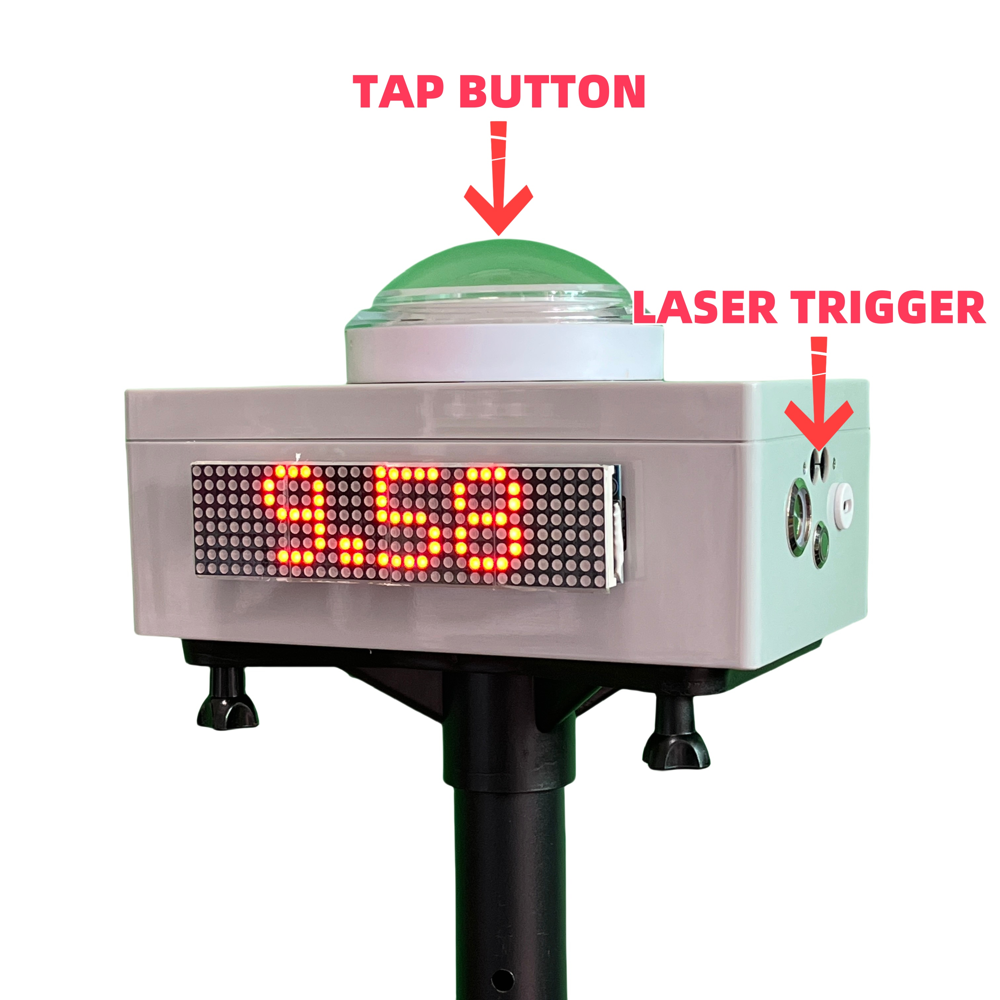

# Guía

## Introducción

El cronómetro IORI es una herramienta sencilla y fácil de usar que puede ayudar rápidamente a los entrenadores a completar las evaluaciones de los miembros del equipo y también puede ser una herramienta poderosa para el entrenamiento individual.

### ¿Por qué hacerlo?

Dirijo personalmente un campamento de fútbol sin ánimo de lucro para adultos, donde entrenamos una vez por semana. También trabajo como entrenador a tiempo parcial los fines de semana para algunos clubes juveniles. Siempre surge el problema de cómo evaluar a los jugadores a largo plazo.

> Pruebas de evaluación, que incluyen ejercicios prácticos diseñados específicamente para obtener los datos más precisos y objetivos posibles de los componentes básicos del juego que forman parte del contenido didáctico. Este tipo de evaluación también se conoce como método cuantitativo.
> -- Manual de entrenamiento de fusal de la UEFA

La evaluación es una parte esencial de la formación, así que, ¿contamos con las herramientas necesarias?

#### Por qué no...?

#### Cronógrafo

Los cronómetros, incluidos los de teléfonos móviles y relojes deportivos, tienen funciones de cronometraje. Sin embargo, presentan dos inconvenientes: primero, se necesita ayuda para configurarlos; segundo, pueden producirse errores al inicio y al final del movimiento de la manecilla. Podemos reemplazar completamente la función del cronómetro, que además permite visualizar el tiempo y grabar vídeos fácilmente.

#### Temporizador infrarrojo/láser

Determinar el inicio y el final sin contacto es, sin duda, el método más preciso en la actualidad y no afecta en absoluto al rendimiento deportivo. Sin embargo, su precio es muy elevado, el equipo es difícil de transportar y su manejo requiere un nivel de conocimiento relativamente alto. Nuestro sistema es mucho más sencillo, incluso los niños pueden dominarlo por completo.

### Ventaja del temporizador IORI

- **No necesita reflector**  
  Simplemente enciéndalo y estará listo para usar, sin complicaciones de configuración.
- **Inalterable a la luz solar**  
  Incluso bajo la luz directa del sol del mediodía, el temporizador se mantiene estable y preciso.
- **Sincronización dividida o sincronización multicanal**  
  Admite múltiples modos con fácil conmutación.
- **Hasta 10 horas de duración de la batería**  
  Se carga completamente en 3 horas y dura más de 10 horas de uso continuo.

## Empezando

1. Mantén pulsado para **LISTO**,
2. Liberar para **INICIO**
3. Disparador láser para **DETENER** ,
4. Mantén pulsado **LISTO de nuevo** .

<!--  -->

<video class="responsive-video" src="../public/videos/10m&30m Sprint.mp4" poster="../public/videos/10m&30m Sprint.png" controls ></video>

<!--  -->

## ¿Cómo funciona?

### El disparador láser no necesita reflector

El cronómetro utiliza un láser infrarrojo seguro para la vista, eliminando la necesidad de un reflector. Por defecto, funciona a una distancia de activación de 1,3 metros, cubriendo fácilmente el ancho de una pista estándar. Para adaptarse a las necesidades de diferentes deportes, la distancia de activación se puede ajustar a 2,3, 4,3 o 6,3 metros, ofreciendo flexibilidad para diversos entornos.

### Conexión inalámbrica de largo alcance

El cronómetro IORI utiliza un protocolo inalámbrico de largo alcance para conectarse a distancias superiores a 200 metros con un control estable y fiable. Admite la conexión simultánea de hasta **11 dispositivos** , lo que lo hace ideal para crear un sistema de cronometraje fraccionado de 100 metros. Esto garantiza una medición precisa del tiempo en diferentes puntos de la pista, proporcionando flexibilidad y exactitud para diversos eventos deportivos.

## ¿Cómo se utiliza?

IORI Timer admite casi todas las pruebas de velocidad y agilidad. Permítanme mostrarles.

### Atletismo

<!-- 通常地，需要一个朋友帮你发令，按住 SET，释放的同时发令 GO，这将包含反应时间。终点使用激光触发结束。 -->

Normalmente, necesitarás la ayuda de un amigo para empezar. Mantén pulsado **READY** para la salida y suéltalo al gritar **GO** ; esto incluirá tu tiempo de reacción. El sensor láser activa la llegada.

<!--  -->

<video class="responsive-video" src="../public/videos/100m.mp4" poster="../public/videos/100m.png" controls ></video>

<!--  -->

#### Prueba de vuelo

<!-- 以前，当使用秒表时，行进间测试非常难获得准确数据。如今，你只需放置计时器在你需要的位置，就可以获得任何区间的时间。
我们支持激光触发启动，同时终点也是激光触发结束。 -->

Antes, era difícil obtener datos precisos para las carreras de velocidad con cronómetro. Ahora, puedes colocar los cronómetros donde los necesites y obtener tiempos exactos para cualquier segmento. Admitimos salidas activadas por láser, y la llegada también se activa mediante un sensor láser.

<!--  -->

<video class="responsive-wide-video" src="../public/videos/Flying Test.mp4" poster="../public/videos/Flying Test.png" controls ></video>

<!--  -->

<!-- #### Split timing system -->

<!-- 很多教练想在一次训练测试中获得 60 米和 100 米的成绩，只需要增加额外的计时器。每多增加一个计时器，就可以多测试一个分段。 -->

<!-- Many coaches want to get both 60m and 10 m results in a single training test.
You only need to add extra timers — each additional timer allows you to record one more split. -->

<!--  -->

<!-- <video class="responsive-video" src="../public/videos/60m&100m Split.mp4" poster="../public/videos/60m&100m Split.png" controls ></video> -->

<!--  -->

<!-- #### Multi-Lane Test -->

### Carrera de 40 yardas

<!-- 按照 NFL Combine 的要求，40 码测试在运动员启动后才开始计时。因此运动员自己手按计时器准备，3 点式启动，这将不包含启动反应时间，非常接近 NFL 的正式测试。终点仍然是激光触发结束。 -->

Según los estándares del NFL Combine, el cronometraje de la carrera de 40 yardas comienza solo después de que el atleta empieza a moverse. Por lo tanto, el atleta puede presionar manualmente el cronómetro para prepararse y comenzar desde una posición de tres puntos; esta configuración excluye el tiempo de reacción y reproduce fielmente la prueba oficial de la NFL. El sensor láser sigue activando la llegada.

<!--  -->

<video class="responsive-video" src="../public/videos/40 Yard Dash.mp4" poster="../public/videos/40 Yard Dash.png" controls ></video>

<!--  -->

<!-- ### Shuttle Run -->

## Modos y ajustes

1. Mantén pulsados ​​simultáneamente el **botón TAP** y el **botón de activación** (botón lateral).
2. Pulsa brevemente el **botón TAP** para cambiar las opciones; mantén pulsado para confirmar.

**Modo** : Prefijo **M.**

- **TAP**: Modo predeterminado. El cronómetro en la línea de **salida/meta** lo utiliza y muestra los resultados completos. Adecuado para pruebas individuales de 100 m o de vuelo.
- **SPT**: Modo dividido. El temporizador entre las líneas de inicio y fin lo utiliza, pero solo muestra el resultado dividido.
- **MORE**: Más opciones de modo, **mantenga pulsado** para acceder al submenú y seleccionar.
  - **PK**: Modo de inicio multipista, utilizado para iniciar la carrera con múltiples carriles de cronometraje. En este momento, todos los cronómetros en los carriles de la línea de meta utilizan el modo SPT.
  - **SET**: Modo de inicio con cuenta regresiva. El zumbador de inicio suena aleatoriamente entre **SET** y **GO** , con un intervalo de 1,5 a 3,5 segundos. Puede reemplazar el modo TAP o PK en la línea de salida.
  - **ADD**: Modo de disparo continuo. Cada disparo suma un resultado. Adecuado para cronometrar carreras de 400 u 800 metros.
  - **LAP**: Modo vuelta, registra el tiempo de cada vuelta. Adecuado para patinaje sobre ruedas.
  - **SHT**: Modo de funcionamiento continuo. El temporizador se detiene tras activarse un número determinado de veces. Adecuado para la prueba **5-10-5**, necesita activarse dos veces antes de detenerse.
  - **KEEP**: Modo de cronometraje continuo. Pulsación corta para pausar o reanudar, pulsación larga para detener. Adecuado para cronometrar partidos.
  - **CNT**: Modo de conteo. Registra una repetición cada vez que se pulsa o se activa. Ideal para ejercicios de conteo como las flexiones.

**Configuración**: Prefijo **S.**

- **TWIN**: Configuración de grupo. Permite la interconexión automática dentro del mismo grupo, como si fueran gemelos. Ideal para que varios grupos realicen pruebas simultáneamente sin interferencias.
- **TRIS**: Configuración de inicio del disparador. Su propósito es permitir que se inicie el disparo del temporizador. Para la prueba de vuelo, es necesario que "TRIS" esté "ON" en el primer temporizador.
- **DIST**: Ajuste de la distancia de activación. Se puede seleccionar entre 1,3 metros, 2,3 metros, etc. El ajuste predeterminado es de 1,3 metros, que cubre el ancho de una pista de atletismo.

**Otro**

- **BT...**: Restablecer conexión Bluetooth. Conecte el teléfono móvil para controlar la grabación de vídeo. El dispositivo Bluetooth se llama “IORI xxx”.
- **ABOUT**: Información sobre el modelo y la versión del software.

::: tip Cambio rápido entre TAP y PK
En el menú M.TAP, un doble clic rápido cambiará al modo PK.
:::

::: tip Diferencias en el menú
Los elementos del menú pueden variar ligeramente en diferentes versiones.
:::

## Opciones de montaje

### Trípode portátil

Compatible con soportes de trípode estándar de rosca de 1/4, lo que facilita su uso en cualquier lugar.

### Otras opciones de montaje

Puedes colocar el dispositivo donde mejor te convenga: sobre una plataforma de salto, una silla o incluso de forma portátil. Su diseño versátil te permite adaptarlo a cualquier entorno, ofreciendo flexibilidad para diferentes actividades.

## Instrucciones de carga

Carga el dispositivo con un cargador con interfaz USB-C. El indicador de encendido se ilumina en rojo durante la carga y se apaga cuando la batería está completamente cargada. Tras realizar pruebas, se ha comprobado que la carga completa tarda aproximadamente 3 horas y que la batería tiene una autonomía de 10 horas .

<!-- ## Official sales channel

The product is officially on sale now. I would love to hear feedback from all over the world. The package includes Timer x1, Quick Release Plate x1, Tripod Tray x1, Waterproof bag x1.

| Item                                                                   | Link                                                                                                                  |
| ---------------------------------------------------------------------- | --------------------------------------------------------------------------------------------------------------------- |
| Timer x1 + Quick Release Plate x1 + Tripod Tray x1 + Waterproof bag x1 | [Amazon](https://a.co/d/g2VKhQx)                                                                                      |
| Tripod                                                                 | [Amazon Basics Adjustable Speaker Stand](https://a.co/d/0aRU0kz) or [5 Core PA Speaker Stand](https://a.co/d/9arTzGT) |

If it is not possible to purchase from Amazon in your country, please contact me, pay with Paypal and I will ship for you separately.

### Product Price

| Package                                                                | Cost   |
| ---------------------------------------------------------------------- | ------ |
| Timer x1 + Quick Release Plate x1 + Tripod Tray x1 + Waterproof bag x1 | US$ 70 |

### Shipping & Taxes

I want to keep shipping costs to a minimum. This is the best price I can get at the moment.

| Region       | Cost      |
| ------------ | --------- |
| USA&CANADA   | US$ 12.00 |
| UK&IRELAND   | US$ 13.00 |
| EUROPE       | US$ 13.00 |
| AUSTRILA     | US$ 12.00 |
| NEWZEALAND   | US$ 12.00 |
| REST OF ASIA | US$ 12.00 |
| OTHER        | US$ 20.00 |

You will be responsible for paying local Tax and duties when applicable. You will not always be required to pay duties or import tax, but it is important that you make yourself aware of the duties that apply in your country in case you are charged. -->

<!-- ## Classic Test

The IORI timer performs all tests with consistent start and end points. Such as shuttle run, T-test and so on. When we design our training program, we try to have the same start and end point. In addition, the IORI timer can be used to test time challenges, such as the maximum time to juggle continuously and the time to plank.

Of course, we can also just take it as a mobile phone remote controller, with mobile phone and mobile phone tripod, can be very convenient for training video recording.

### T-test

The T-test includes accelerate, decelerate, shuffle, and backward, which are the basic movements required in football. Standard movement, and shorter completion time, the stronger the athletic ability.

[T test video](https://www.instagram.com/p/CgziY7tAAVw/)

### 60 ball juggling challenge

The time it takes to complete 60 ball juggle. Drop the ball can be picked up to continue, the number continues to accumulate until the number of 60. -->

## Contáctanos

Hemos publicado muchos vídeos de pruebas reales en Instagram y TikTok. Síguenos para ver más.

- Instagram: <https://www.instagram.com/iori.speed/>
- TikTok: <https://www.tiktok.com/@ioritimer>

También puedes contactarme por correo electrónico o unirte a nuestro grupo de fans de WhatsApp.

- Correo electrónico: <ioritimer@gmail.com>
- Grupo de WhatsApp: [IORI Speed](https://chat.whatsapp.com/FvH3O5wqDBgGBYiNyWpEtT?mode=ems_copy_t)

<!-- ## Some of Our Clients

JT Physical Training Academy, Derby County on UK, Shenzhen Green Field Youth Training, Shenzhen Football Association U10/U11 Women's Elite Team Selection, Shenzhen Wanderers U8-U12 Elite Team Selection, Jiangsu Football Association, Beijing Normal University Shenzhen Independent Enrollment Selection, Hong Kong Leaper Sport Lab, Tongji University in Shanghai, University of Nottingham Ningbo China, Huaqiao University, Ganzhou Fire Department, Beijing People's Procuratorate, etc. -->

## Sobre nosotros

El producto ha sido diseñado por el equipo del [campamento de fútbol Shenzhen YQT ](https://zuqiuxunlian.github.io/en/).

Muchas gracias al entrenador Lu, Juca Grajau (Brasil) del club Shenzhen FC116, al entrenador Yang Bin del club Shenzhen Rangers, al entrenador Xu Jianning de la ciudad de Xiamen, al entrenador Yang del club Wuhan Huangbei Jianxiao y al entrenador Zhao del Football Salon. Se brindaron muchas sugerencias útiles durante el desarrollo y las pruebas.
