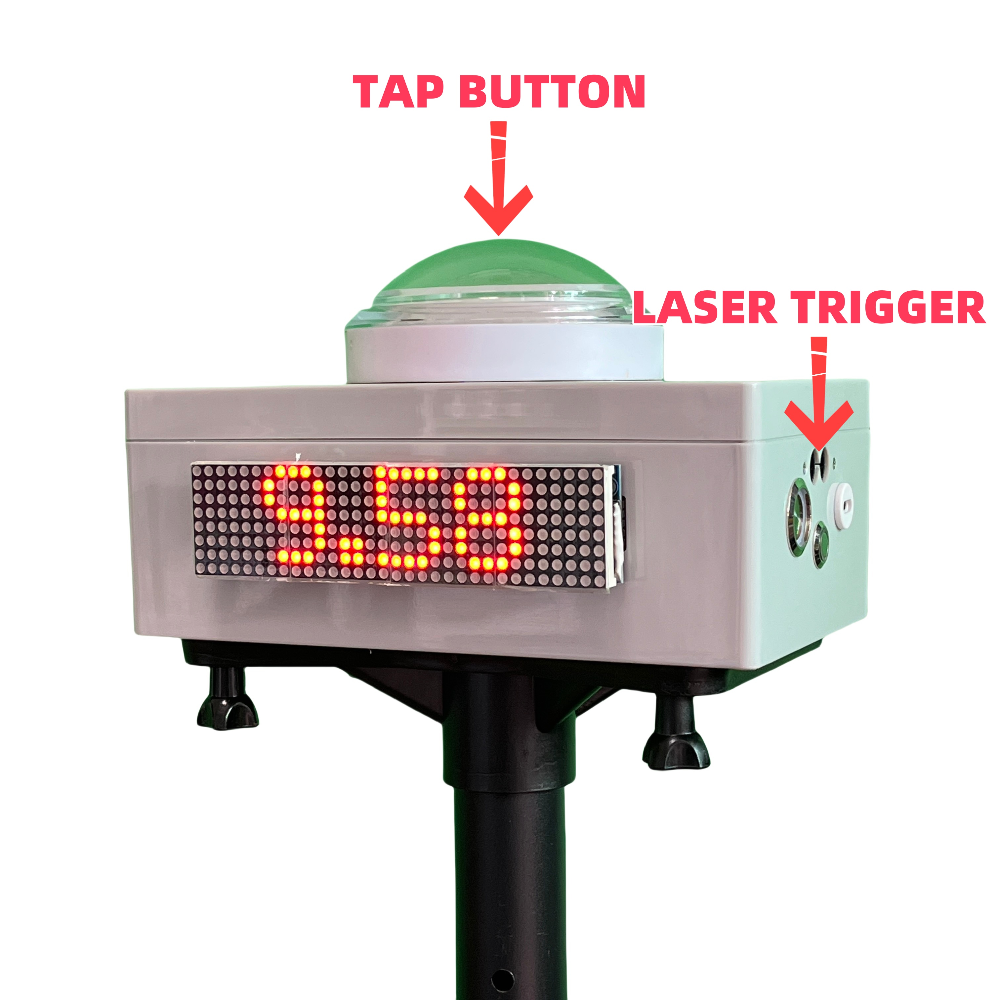

# Guide

## Introduction

The IORI timer is a simple and easy to use that can quickly assist coaches in completing test evaluations of team members and can also be a powerful tool to individual training.

### Why do it

I personally run a non-profit football camp for adults that we train once a week. I also work as a part-time weekend coach for some youth clubs. There is always the problem of how to evaluate the players in the long-term training.

> Evaluation tests, which involve practical exercises designed specifically to obtain the most precise and objective data possible from the basic game components forming part of the teaching content. This type of evaluation is also known as the quantitative method.  
> -- UEFA Fusal Coaching Manual

Evaluation is an essential part of training, so do we have tools to use?

#### Why Not...?

#### Stopwatch

Stopwatches, including mobile phones and sports watches, have timing functions. But there are two disadvantages. You need someone to help you set the watch. Second, there are certain errors in the beginning and end of the hand pinch. We can replace the function of a stopwatch that can be completely replaced, and the time is visible and easy to video record.

#### Infrared/laser timer

To judge the beginning and end by a non-contact way is indeed the most accurate way at present, and does not affect sports performance at all. However, its price is also very expensive, the equipment is not convenient to carry, and the operation threshold of the equipment is relatively high. Our operation is much simpler, even the children can fully master.

### IORI timer advantage

- **No Reflector Needed**  
  Just power it on and you're ready to go—no setup hassle.
- **Unaffected by Sunlight**  
  Even under direct noon sun, the timer remains stable and accurate.
- **Split Timing or Multi-Lane Timing**  
  Multiple modes supported with easy switching.
- **Up to 10 Hours of Battery Life**  
  Fully charges in 3 hours, lasts over 10 hours of continuous use.

## Getting Started

1. Long Press to **READY**,
2. Release to **START**,
3. Laser Trigger to **STOP**,
4. Long Press **READY again**.

<!--  -->

<video class="responsive-video" src="./public/videos/10m&30m Sprint.mp4" poster="./public/videos/10m&30m Sprint.png" controls ></video>

<!--  -->

## How it works?

### Laser trigger not need relector

The timer utilizes eye-safe infrared laser, eliminating the need for reflector. By default, it operates over a trigger distance of 1.3 meters, easily covering the width of a standard track. For different sports need, the trigger distance can be adjusted to 2.3, 4.3, or 6.3 meters, offering flexibility for a variety of environments.

### Wireless connect long way

The IORI timer uses a long-range wireless protocol to connect over distances greater than 200 meters with stable and reliable control. It supports simultaneous connection of up to **11 devices**, making it ideal for creating a 100m split timing system. This ensures accurate timing across different points on the track, providing flexibility and precision for various sporting events.

## How to use?

IORI Timer supports almost all sprint and agility test. Let me show you.

### Track and Field

<!-- 通常地，需要一个朋友帮你发令，按住 SET，释放的同时发令 GO，这将包含反应时间。终点使用激光触发结束。 -->

Normally, you’ll need a friend to help you with the start.
Hold down **READY** for set, and release it while calling **GO** — this will include your reaction time.
The finish is triggered by the laser sensor.

<!--  -->

<video class="responsive-video" src="./public/videos/100m.mp4" poster="./public/videos/100m.png" controls ></video>

<!--  -->

#### Flying test

<!-- 以前，当使用秒表时，行进间测试非常难获得准确数据。如今，你只需放置计时器在你需要的位置，就可以获得任何区间的时间。
我们支持激光触发启动，同时终点也是激光触发结束。 -->

In the past, it was difficult to get accurate data for flying sprints when using a stopwatch.
Now, you can place the timers wherever you need and get precise times for any segment.
We support laser-triggered starts, and the finish is also activated by a laser sensor.

<!--  -->

<video class="responsive-wide-video" src="./public/videos/Flying Test.mp4" poster="./public/videos/Flying Test.png" controls ></video>

<!--  -->

<!-- #### Split timing system -->

<!-- 很多教练想在一次训练测试中获得 60 米和 100 米的成绩，只需要增加额外的计时器。每多增加一个计时器，就可以多测试一个分段。 -->

<!-- Many coaches want to get both 60m and 10 m results in a single training test.
You only need to add extra timers — each additional timer allows you to record one more split. -->

<!--  -->

<!-- <video class="responsive-video" src="./public/videos/60m&100m Split.mp4" poster="./public/videos/60m&100m Split.png" controls ></video> -->

<!--  -->

<!-- #### Multi-Lane Test -->

### 40 Yard Dash

<!-- 按照 NFL Combine 的要求，40 码测试在运动员启动后才开始计时。因此运动员自己手按计时器准备，3 点式启动，这将不包含启动反应时间，非常接近 NFL 的正式测试。终点仍然是激光触发结束。 -->

According to NFL Combine standards, the 40-yard dash timing starts only after the athlete begins to move.
Therefore, the athlete can manually press the timer to get ready and start from a 3-point stance — this setup excludes reaction time and closely replicates the official NFL test.
The finish is still triggered by the laser sensor.

<!--  -->

<video class="responsive-video" src="./public/videos/40 Yard Dash.mp4" poster="./public/videos/40 Yard Dash.png" controls ></video>

<!--  -->

<!-- ### Shuttle Run -->

## Mounting Options

### Portable Tripod

Compatible with standard 1/4 screw tripod mounts, making it easy to use on the go.

### Other Mounting Options

You can place the device anywhere that suits your needs—on a jump box, a chair, or even handheld. The versatile design ensures you can adapt the setup to any environment, providing flexibility for different activities.

## Charging instructions

Charge the device with a Type-C interface charger. The power light turns red during charging and goes off when fully charged. After actual testing, it takes about 3 hours to fully charge and the battery can last for **10 hours** when fully charged.

<!-- ## Official sales channel

The product is officially on sale now. I would love to hear feedback from all over the world. The package includes Timer x1, Quick Release Plate x1, Tripod Tray x1, Waterproof bag x1.

| Item                                                                   | Link                                                                                                                  |
| ---------------------------------------------------------------------- | --------------------------------------------------------------------------------------------------------------------- |
| Timer x1 + Quick Release Plate x1 + Tripod Tray x1 + Waterproof bag x1 | [Amazon](https://a.co/d/g2VKhQx)                                                                                      |
| Tripod                                                                 | [Amazon Basics Adjustable Speaker Stand](https://a.co/d/0aRU0kz) or [5 Core PA Speaker Stand](https://a.co/d/9arTzGT) |

If it is not possible to purchase from Amazon in your country, please contact me, pay with Paypal and I will ship for you separately.

### Product Price

| Package                                                                | Cost   |
| ---------------------------------------------------------------------- | ------ |
| Timer x1 + Quick Release Plate x1 + Tripod Tray x1 + Waterproof bag x1 | US$ 70 |

### Shipping & Taxes

I want to keep shipping costs to a minimum. This is the best price I can get at the moment.

| Region       | Cost      |
| ------------ | --------- |
| USA&CANADA   | US$ 12.00 |
| UK&IRELAND   | US$ 13.00 |
| EUROPE       | US$ 13.00 |
| AUSTRILA     | US$ 12.00 |
| NEWZEALAND   | US$ 12.00 |
| REST OF ASIA | US$ 12.00 |
| OTHER        | US$ 20.00 |

You will be responsible for paying local Tax and duties when applicable. You will not always be required to pay duties or import tax, but it is important that you make yourself aware of the duties that apply in your country in case you are charged. -->

<!-- ## Classic Test

The IORI timer performs all tests with consistent start and end points. Such as shuttle run, T-test and so on. When we design our training program, we try to have the same start and end point. In addition, the IORI timer can be used to test time challenges, such as the maximum time to juggle continuously and the time to plank.

Of course, we can also just take it as a mobile phone remote controller, with mobile phone and mobile phone tripod, can be very convenient for training video recording.

### T-test

The T-test includes accelerate, decelerate, shuffle, and backward, which are the basic movements required in football. Standard movement, and shorter completion time, the stronger the athletic ability.

[T test video](https://www.instagram.com/p/CgziY7tAAVw/)

### 60 ball juggling challenge

The time it takes to complete 60 ball juggle. Drop the ball can be picked up to continue, the number continues to accumulate until the number of 60. -->

## Contact Us

You can contact me with Email or Join Whatsapp fans group.

- Email: <ioritimer@gmail.com>
- Whatsapp Group: [IORI Speed](https://chat.whatsapp.com/FvH3O5wqDBgGBYiNyWpEtT?mode=ems_copy_t)

<!-- ## Some of Our Clients

JT Physical Training Academy, Derby County on UK, Shenzhen Green Field Youth Training, Shenzhen Football Association U10/U11 Women's Elite Team Selection, Shenzhen Wanderers U8-U12 Elite Team Selection, Jiangsu Football Association, Beijing Normal University Shenzhen Independent Enrollment Selection, Hong Kong Leaper Sport Lab, Tongji University in Shanghai, University of Nottingham Ningbo China, Huaqiao University, Ganzhou Fire Department, Beijing People's Procuratorate, etc. -->

## About Us

The product is designed by [Shenzhen Yiqiti Football Camp](https://zuqiuxunlian.github.io/en/) team.

Many thanks to Coach Lu, Juca Grajau (Brazil) of Shenzhen FC116 Club, Coach Yang Bin of Shenzhen Rangers Club, Coach Xu Jianning of Xiamen City, Coach Yang of Wuhan Huangbei Jianxiao Club, and Coach Zhao of Football Salon. Many helpful suggestions were given during development and testing.
